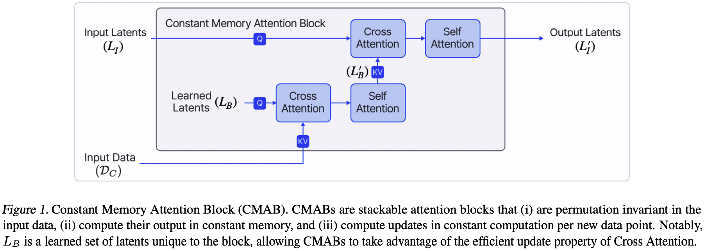
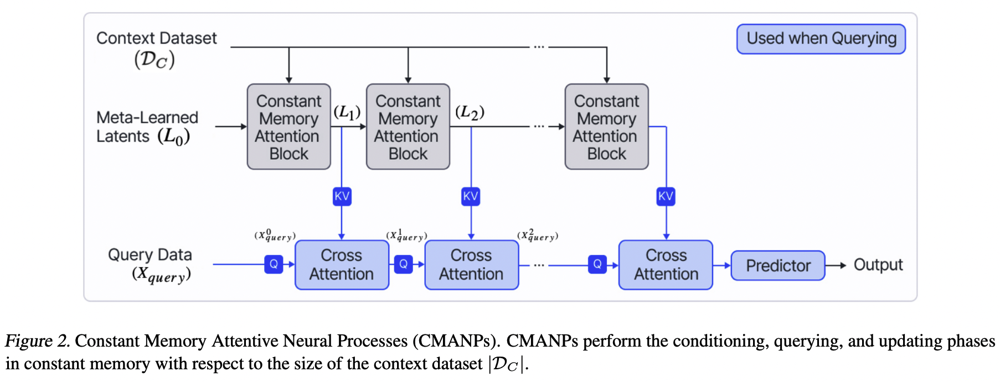

# Memory Efficient Neural Processes via Constant Memory Attention Block

This is the official implementation of the paper [Memory Efficient Neural Processes via Constant Memory Attention Block](https://openreview.net/forum?id=xtwCf7iAs2). 

This repository includes our implementation of Constant Memory Attention Block (CMAB) and Constant Memory Attentive Neural Processes (CMANPs).

CMAB is a novel attention block that (i) is permutation invariant, (ii) computes its output in constant memory, and (iii) performs constant computation updates.


CMANP is a NP variant that builds on CMAB, requiring only constant memory unlike previous existing attention-based NPs. Empirically, CMANPs achieve results competitive with other SOTA NPs on popular benchmarks while requiring only constant memory.




## Install

Create and activate a conda environment. Install the dependencies as listed in `requirements.txt`:

```
conda create --name cmanp python=3.7
conda activate cmanp
pip install -r requirements.txt
```

## Usage

Please check the `regression` directory for specific usage.

## Reference

For technical details, please check the conference version of our paper.
```
@inproceedings{
    feng2024memory,
    title={Memory Efficient Neural Processes via Constant Memory Attention Block},
    author={Leo Feng and Frederick Tung and Hossein Hajimirsadeghi and Yoshua Bengio and Mohamed Osama Ahmed},
    booktitle={International Conference on Machine Learning},
    year={2024},
    url={https://openreview.net/forum?id=xtwCf7iAs2}
}
```

## Acknowledgement

This code is based on the official code base of [Latent Bottlenecked Attentive Neural Processes](https://github.com/BorealisAI/latent-bottlenecked-anp).


